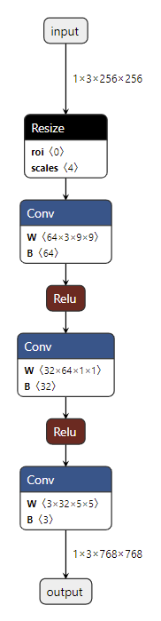
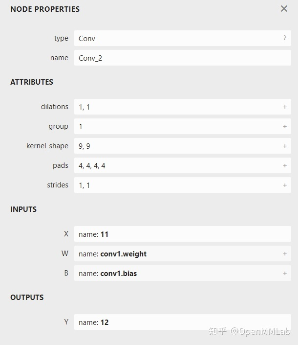

# Onnx Basic

比如点击第一个 Conv 可以看到

每个算子记录了算子属性、图结构、权重三类信息。

- **算子属性信息**即图中 attributes 里的信息，对于卷积来说，算子属性包括了卷积核大小(kernel_shape)、卷积步长(strides)等内容。这些算子属性最终会用来生成一个具体的算子。

- **图结构信息**指算子节点在计算图中的名称、邻边的信息。对于图中的卷积来说，该算子节点叫做 Conv_2，输入数据叫做 11，输出数据叫做 12。根据每个算子节点的图结构信息，就能完整地复原出网络的计算图。
- **权重信息**指的是网络经过训练后，算子存储的权重信息。对于卷积来说，权重信息包括卷积核的权重值和卷积后的偏差值。点击图中 conv1.weight, conv1.bias 后面的加号即可看到权重信息的具体内容。